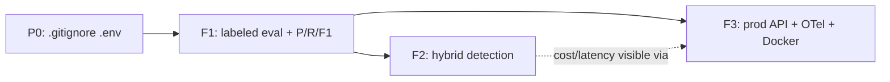

# AgentShield — Immediate Build Plan (Top 3)

> **Status update (2026-07-09): all three features shipped.**
> **F1** — done: `agentshield eval` + 50-artifact labeled corpus, micro F1 98.08%, CI-gated.
> **F2** — done and measured: deterministic semantic confirmer on by default; guarded LLM
> tier built but flag-off because `gpt-4o-mini` doesn't beat the baseline
> ([METRICS_AND_OUTCOMES.md](./METRICS_AND_OUTCOMES.md)).
> **F3** — mostly done: token auth, config-driven CORS, Docker + compose, live Render +
> Vercel deploy; structured logging + OpenTelemetry remain open.
> The text below is the original plan, kept as the engineering record.

> The three features to build next, in order, with exact technical steps, files, tests,
> metrics, and the résumé/interview payoff. Grounded in the real codebase. No code is
> partially implemented. Use this as the next-step plan from the current baseline.

**P0 housekeeping status:** `.env` is ignored locally and `git log -- .env` shows no
committed secret history.

---

## Feature 1 — Independent labeled validation harness + precision/recall

### Why now
Every credibility claim depends on it. The harness now exists and the current corpus has
50 labeled artifacts, including 27 hard negatives and 10+ positives in every category. It
is strong enough for development gating, but still mixes public artifacts with authored
challenge fixtures.

### Exact technical work
1. **Corpus:** expand `benchmarks/labeled/` with real artifacts (MCP servers, tool
   manifests, agent configs — extend the existing `benchmarks/phase7_public_artifacts/`
   set). Each artifact gets a sibling `*.labels.yaml`:
   ```yaml
   artifact: filesystem.index.ts
   expected_findings:
     - category: UNSAFE_PERMISSIONS
       true_positive: true
     - category: DATA_EXFILTRATION_PATTERN
       true_positive: false   # known noise
   ```
   Label independently of the rules (don't reverse-engineer from current output).
2. **Scorer:** `agentshield/eval/scorer.py` — run `run_static_scan` (or `run_scan`)
   over each artifact, compare detected vs labeled, compute **precision, recall, F1,
   false-positive rate** per category and overall.
3. **CLI:** `agentshield eval benchmarks/labeled` in `agentshield/cli.py` (mirror the
   `benchmark` command structure at `cli.py:105`), exit non-zero if F1 drops below a
   configurable floor.
4. **Metrics:** `agentshield/models/metrics.py` + `metrics/aggregator.py` include an
   `EvalMetrics` block; write into `metrics.json` and `PROJECT_METRICS.md`.
5. **CI:** `.github/workflows/ci.yml` runs the labeled eval corpus.

### Files to create/edit
- New: `benchmarks/labeled/**`, `agentshield/eval/__init__.py`, `agentshield/eval/scorer.py`,
  `tests/test_eval.py`.
- Edit: `agentshield/cli.py`, `agentshield/models/metrics.py`,
  `agentshield/metrics/aggregator.py`, `agentshield/metrics/report_writer.py`,
  `.github/workflows/ci.yml`.

### Tests to add (`tests/test_eval.py`)
- Perfect-detection fixture → precision=recall=F1=1.0.
- All-false-positive fixture → precision=0.
- Missed-finding fixture → recall<1.
- Category-level aggregation correctness.
- CLI exit code: F1 below floor → exit 1.

### Metrics to track
- **Precision / Recall / F1 overall and per category** on the current labeled corpus.
- **False-positive rate per 1,000 lines** of prose/docs.
- Corpus size + label provenance.

### Résumé bullet (after real numbers exist)
*"Built a labeled benchmark harness for AI-agent security detection; established an
initial precision/recall/F1 baseline across 50 labeled artifacts and gated it in CI."*

### Interview story
"I refused to trust only self-authored tests, so I built a labeled corpus and scorer. The
50-artifact baseline exposes two README URL false positives; the next step is using those
hard negatives to prove semantic precision gains."

---

## Feature 2 — Hybrid rules + semantic detection engine

### Why now
This is the product's actual moat and the strongest AI-engineering signal. The current
detector is `if marker in text.lower()` (`rules/suspicious_patterns.py:16`) — evadable and
noisy. With Feature 1's harness in place, you can **prove** the hybrid engine beats
rules-only. Without F1 first, you're flying blind.

### Exact technical work
1. **New module** `agentshield/detect/semantic.py`: a `SemanticDetector` that, given a
   candidate finding + surrounding context, asks an LLM "is this genuinely
   {tool-poisoning|injection|exfil|drift|unsafe-perm}? Return `{verdict, confidence,
   reason}` as strict JSON." **Reuse the proven pattern** from `dynamic/llm_judge.py`
   (provider-pluggable, strict-JSON, fail-fast `*Error`, urllib or SDK).
2. **Triage / routing** in `services/scan_service.py` (or a new `services/triage.py`): a
   `mode` param `rules | hybrid | semantic`. In `hybrid`, run `run_all_rules` first
   (cheap), then escalate **only ambiguous** candidates (low-severity tiers like `EXF-003`,
   prose-context hits, near-misses) to `SemanticDetector`. Clear-cut critical markers skip
   the LLM. This makes `metrics/aggregator.py:129`'s hardcoded `llm_routing_rate=0.0` a
   **real measured ratio**.
3. **Provenance:** add `detection_stage` (`rule` | `semantic`) and `confidence` to
   `models/finding.py`, the report payloads, and the `findings` table
   (`storage/sqlite_store.py` via `_ensure_columns`).
4. **Caching:** key semantic verdicts by content hash so identical tool descriptions aren't
   re-sent (local dict/file now; Redis when hosted — see tech analysis).
5. **Graceful degradation:** if the semantic stage errors/timeouts, fall back to rules-only
   results with a `semantic_unavailable` flag — never hard-fail a CI scan on LLM outage.
6. **Config:** flags in `config.py` + `.env.example` (`AGENTSHIELD_DETECTION_MODE`,
   reuse `OPENAI_API_KEY`/`CLAUDE_API_KEY`).

### Files to create/edit
- New: `agentshield/detect/__init__.py`, `agentshield/detect/semantic.py`,
  `tests/test_semantic.py`.
- Edit: `agentshield/services/scan_service.py`, `agentshield/services/rule_runner.py`,
  `agentshield/models/finding.py`, `agentshield/storage/sqlite_store.py`,
  `agentshield/reporting/json_report.py` + `markdown_report.py`,
  `agentshield/metrics/aggregator.py`, `agentshield/config.py`, `.env.example`,
  `agentshield/cli.py` (add `--mode`).

### Tests to add (`tests/test_semantic.py`)
- Mocked LLM confirms a paraphrased injection that the substring rules **miss** (proves
  recall gain).
- Mocked LLM dismisses a prose false positive the rules flag (proves precision gain).
- Triage routes only ambiguous candidates (clear critical markers never call the LLM).
- Cache hit avoids a second LLM call for identical content.
- Semantic-stage failure → rules-only fallback + flag (no exception escapes).

### Metrics to track
- **Hybrid F1 vs rules-only F1** on the Feature 1 corpus (the headline comparison).
- **Real `llm_routing_rate`** (escalated ÷ candidates) and **cache hit rate**.
- **LLM latency + token cost per scan** (ties into Feature 3 OTel).

### Résumé bullet
*"Designed a cost-aware hybrid detection engine (deterministic rules pre-filter + LLM
intent confirmation with content-hash caching); improved F1 from X (rules-only) to Y while
routing only Z% of candidates to the LLM."* — fill X/Y/Z from real runs.

### Interview story
"Pure rules were evadable; pure LLM was slow and expensive. I built a triage layer that
escalates only ambiguous findings, cached verdicts by content hash, and measured the
precision/recall lift against an independent corpus."

---

## Feature 3 — Productionize the API: auth + structured logging + OpenTelemetry + Docker

### Why now
It converts "local script" into "deployable, secured, observable service" — the signal
backend/cloud/platform recruiters look for — and it's where you finally measure the latency
and cost numbers currently marked *Not measured yet*. It also makes Feature 2's LLM costs
visible.

### Exact technical work
1. **Auth:** add a FastAPI dependency in `web/app.py` validating an API key (header) or JWT
   on all `/api/*` except `/api/health`. Key/secret + `allowed_origins` in `config.py`.
   Replace `CORS allow_origins=["*"]` (`web/app.py:52`) with the allowlist. Send the header
   from `web/src/lib/api.ts`.
2. **Structured logging:** new `agentshield/observability/logging.py` configuring stdlib
   `logging` (JSON) that honors the **already-defined but unused** `agentshield_log_level`
   in `config.py`. Log one structured event per scan + per finding.
3. **OpenTelemetry:** new `agentshield/observability/tracing.py` (OTel SDK). Instrument
   spans around `run_static_scan`/`run_scan` (`services/scan_service.py`), per-file
   parse+rules, `detect.semantic` (attrs: model, tokens, latency, cache hit/miss),
   `evaluate_trace` (`policy/policy_engine.py`), and the LLM HTTP calls in
   `dynamic/llm_judge.py` + `detect/semantic.py`. Console exporter locally; OTLP when hosted.
4. **Docker:** multistage `Dockerfile` (build `web/` → serve FastAPI + static) +
   `.dockerignore`. `docker run -p 8000:8000 agentshield` serves API + console.
5. **CI:** add `docker build` to `ci.yml`; add `pytest --cov` gate.

### Files to create/edit
- New: `agentshield/observability/__init__.py`, `observability/logging.py`,
  `observability/tracing.py`, `Dockerfile`, `.dockerignore`.
- Edit: `agentshield/web/app.py`, `agentshield/config.py`, `.env.example`,
  `web/src/lib/api.ts`, `tests/test_web_api.py`, `.github/workflows/ci.yml`,
  `pyproject.toml` (deps: `opentelemetry-sdk`, optional `prometheus-client`).

### Tests to add (`tests/test_web_api.py`)
- Unauthed `/api/scan` → 401; valid key → 200.
- `/api/health` reachable without auth.
- CORS preflight from a non-allowed origin is rejected.
- A scan emits a trace span (assert via in-memory OTel exporter).

### Metrics to track
- **p50/p95 scan latency** (rules vs hybrid) — currently *Not measured yet*.
- **LLM cost + token usage per scan**; **error rate**; **auth failure rate**.

### Résumé bullet
*"Shipped a containerized, API-key-authenticated FastAPI scan service with OpenTelemetry
tracing across the rule + LLM pipeline and structured JSON logging; surfaced p95 latency and
per-scan LLM cost."*

### Interview story
"I instrumented the whole scan path with OTel — including the LLM calls — so I could see
that semantic escalation drove p95; that data justified the verdict cache, which cut it back
down."

---

## Sequencing & dependencies



- **F1 must come first** — it's how F2's value is proven and F3's gates are set.
- F2 and F3 can proceed in parallel after F1; F3's OTel makes F2's cost/latency measurable.
- Each feature lands with its tests green (`pytest`) and its metrics written to
  `metrics.json` — keeping the project's existing test-and-measure discipline intact.
