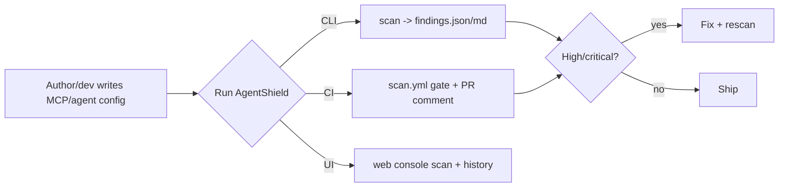

# AgentShield — Product Document

> Product framing derived from the codebase, `PROJECT.md`, and `DECISIONS.md` on
> 2026-06-24. Companion: [PROJECT_MASTER.md](./internal/PROJECT_MASTER.md).

---

## 1. Product idea

A **security linter and test harness for tool-using AI agents and MCP servers.** Point
it at a config/repo; it flags poisoned tool descriptions, prompt-injection text, unsafe
permission grants, exfiltration patterns, and task-drift content; it scores severity,
writes reproducible reports, and gates CI. Optionally it runs scripted attack
simulations and uses an LLM judge to suppress false positives.

## 2. User pain points

- "I publish an MCP server and have **no automated check** that a tool description
  isn't smuggling instructions to the model."
- "Prompt-injection lives in **fetched content**, not the user's prompt — my normal
  review never sees it."
- "I can't tell if a tool config grants **too much** (filesystem + network + shell)."
- "Security review of agent configs is **manual, inconsistent, and unrepeatable.**"
- "I want a **CI gate** with a clear pass/fail, not a vibes-based review."

## 3. User personas

| Persona | Context | Goal | Today's workaround |
|---|---|---|---|
| **Maya — MCP server author** | Ships an open-source MCP server | Catch risky tool/prompt text before release | Eyeballing, hope |
| **Devin — agent app developer** | Integrates third-party MCP servers into a product | Block unsafe configs in PRs | None / generic SAST that doesn't understand agents |
| **Priya — AppSec reviewer** | Reviews agent features for a platform team | Reproducible, severity-ranked findings to triage | Manual notes per review |
| **Sam — the author** | Building a portfolio-grade security project | Demonstrate end-to-end security engineering | N/A |

## 4. User stories

- As **Maya**, I run `agentshield scan ./my-server` and get a Markdown report listing
  every flagged tool/prompt with severity and a recommendation.
- As **Devin**, I add `scan.yml` so any PR that introduces a high/critical finding
  fails CI and gets an inline summary comment.
- As **Priya**, I open the web console's Run History and inspect findings + evidence +
  recommendations per past scan.
- As **Devin**, I run `agentshield simulate` to see how the policy engine reacts to the
  five canonical attack categories, and toggle an LLM judge to cut noise.
- As **Sam**, I run `agentshield metrics` to produce a defensible, data-backed summary
  of coverage and benchmark pass rate.

## 5. Jobs-to-be-done

1. **When** I'm about to ship an MCP server, **I want** an automated risk scan, **so I**
   don't expose a poisoned/over-permissioned tool.
2. **When** a teammate opens a PR touching agent config, **I want** a CI gate, **so**
   unsafe changes don't merge silently.
3. **When** triaging a flagged config, **I want** severity + evidence + a fix
   recommendation, **so I** can act fast.
4. **When** demonstrating detection quality, **I want** benchmark + metrics output,
   **so I** can defend the tool's accuracy claims.

## 6. MVP features (delivered)

- `agentshield scan` with JSON + Markdown output and severity gating.
- Config parsing for JSON/YAML/TOML/Markdown/raw text.
- 11 rules across 5 categories.
- Deterministic severity + 0–100 risk score.
- SQLite persistence of every run.
- YAML benchmark harness (9 cases, 100% pass).

All six map directly to the Phase-1 success criteria in `PROJECT.md` §14.

## 7. Feature priority

| Priority | Feature | Status |
|---|---|---|
| P0 | Static scan + reports + exit-code gate | ✅ Done |
| P0 | Rule coverage of 5 categories | ✅ Done (11 rules) |
| P1 | CI integration (Actions) | ✅ Done |
| P1 | Benchmark harness | ✅ Done |
| P2 | Dynamic simulation + policy engine | ✅ Done (scripted) |
| P2 | LLM judge (noise reduction) | ✅ Done (OpenAI primary) |
| P2 | Web console | ✅ Done (F1–F9) |
| **P0 (next)** | **Independent validation / real precision-recall** | In progress (50 labeled artifacts) |
| **P1 (next)** | **Semantic detection mode** | ❌ Missing |
| P2 (next) | `.env` gitignore + API auth before hosting | ❌ Missing |

## 8. Product workflows

## 9. Success metrics

> These are the metrics the product *should* be judged on. Where the repo has real
> numbers, they're cited in [METRICS_AND_OUTCOMES.md](./METRICS_AND_OUTCOMES.md);
> precision/recall is now measured on a small labeled corpus; it should not be treated as
> a broad accuracy claim until the corpus is larger and independently reviewed.

- **Detection precision** (flagged-and-real ÷ flagged) — 96.23% micro precision on 50 labeled artifacts.
- **Detection recall** (caught ÷ all real issues) — 100% micro recall on 50 labeled artifacts.
- **False-positive rate in prose/docs** — partially characterized by Phase 7 (the
  remaining 7–10 findings on 29 artifacts are mostly README signal/noise).
- **Benchmark pass rate** — 100% (9/9), but on self-authored cases.
- **Adoption proxies** (installs, CI workflows enabled, scans run) — *N/A, unreleased.*
- **Time-to-finding** — sub-second per file (good).

## 10. Product risks

- **Credibility risk:** a "security" product whose detection is naive substring matching
  invites skepticism; a single embarrassing false positive/negative undercuts trust.
- **Circular-validation risk:** benchmarks/sims authored with the rules overstate accuracy.
- **Scope-creep risk:** the project already pulled dashboard/sim/Actions in from "out of
  scope"; further breadth without depth (real detection quality) dilutes the value prop.
- **Market risk:** as MCP tooling matures, platform vendors may ship built-in checks.

## 11. Differentiation from existing products

- **vs generic SAST (Semgrep, Bandit, CodeQL):** those scan code for code-level bugs;
  AgentShield scans **agent/MCP config + tool/prompt text** for **agent-specific threat
  classes** (tool poisoning, indirect injection, task drift) those tools don't model.
- **vs prompt-injection research demos:** AgentShield is **packaged, CI-ready,
  reproducible**, with severity scoring, persistence, and a console — not a notebook.
- **vs LLM-guardrail libraries (e.g. runtime input/output filters):** AgentShield is a
  **pre-deployment static scanner + harness**, complementary to runtime guards.
- **Honest caveat:** the *detection technique* is currently simpler than some research
  tools. The differentiation today is **packaging, lifecycle coverage, and CI fit** —
  not detection sophistication. Closing the detection gap (semantic mode) is the clearest
  path to durable differentiation.
