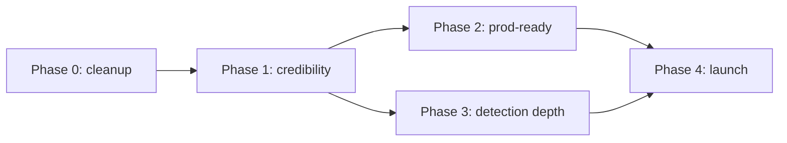

# AgentShield — Build Roadmap

> Phase-by-phase plan to take AgentShield from a working v0.1 local tool to a credible,
> production-capable agent-security product. Grounded in
> [IMPLEMENTATION_STATUS.md](./IMPLEMENTATION_STATUS.md). Dates relative to 2026-06-24.

---

## Phase 0 — Repo cleanup & setup

**Goal:** remove footguns and noise before building anything new.

| Task | Priority | Files | DoD |
|---|---|---|---|
| Add `.env` to `.gitignore`; verify no key in history | **Done locally** | `.gitignore` | `git log -- .env` shows no committed secret; `.env` ignored |
| Consolidate output dirs (`reports/`, `reports-test/`, `agentshield-output/`, `agentshield-reports/`) into one ignored dir | P1 | `.gitignore`, CLI defaults | One canonical output dir; rest gitignored/removed |
| Stop committing `*.db`, `agentshield.egg-info/`, `.DS_Store` | P1 | repo root | Clean `git status` |
| Reconcile stale scope text in `PROJECT.md` §3/§13 | P2 | `PROJECT.md` | Docs match shipped reality |

**Risks:** rewriting git history if a secret was ever committed (needs care/force-push).

## Phase 1 — MVP completion & detection credibility

**Goal:** prove the product actually detects well, not just that it runs.

| Task | Priority | Files | DoD |
|---|---|---|---|
| Build an **independent labeled corpus** (real MCP servers/agent repos, human-labeled true/false) | In progress | `benchmarks/labeled/` | 50 labeled artifacts now; next expand public-only subset |
| Compute **real precision/recall/F1** on that corpus | Done for current corpus | `eval/scorer.py`, `metrics/` | Current 50-artifact numbers in [METRICS_AND_OUTCOMES.md](./METRICS_AND_OUTCOMES.md) |
| Make `.py`/`.ts` first-class in directory scans | **Done** | `parser/discovery.py` | Dir scan covers source files and still skips vendor/build dirs |
| First **frontend tests** (Vitest + RTL) per page | **Done** (Static Scan + Dashboard; extend to remaining pages) | `web/src/pages/*.test.tsx` | Happy/empty/error paths green in CI |

**Risks:** real precision/recall may expose weak detection — that's the point; budget for
rule/semantic work in response.

## Phase 2 — Production readiness

**Goal:** make it safe and possible to run beyond one laptop.

| Task | Priority | Files | DoD |
|---|---|---|---|
| API auth (token) + explicit CORS allowlist | **Done** | `web/app.py`, `config.py` | Unauthed requests → 401; origins from `AGENTSHIELD_CORS_ORIGINS` |
| Dockerfile + compose (API + static frontend) | **Done** (+ live Render/Vercel deploy) | `Dockerfile`, `docker-compose.yml`, `render.yaml`, `web/vercel.json` | `docker compose up` serves API + UI |
| Structured logging honoring `agentshield_log_level` | P1 | `config.py`, new `logging` setup | Configurable JSON logs |
| SQLite FKs + indexes | **Done** (Postgres/Alembic deferred until hosted persistence is needed) | `storage/sqlite_store.py` | FK cascades + indexes on FK/ordering columns |
| Publish CLI to PyPI; add pre-commit hook | P2 | `pyproject.toml`, new hook | `pip install agentshield` works |

**Risks:** auth + Postgres introduce real ops surface; only do if hosting is decided.

## Phase 3 — Scaling & advanced features

**Goal:** depth in detection and real-world fit.

| Task | Priority | Files | DoD |
|---|---|---|---|
| **Semantic detection mode** | **Shipped + measured** — deterministic confirmer on by default (F1 98.08%); LLM tier flag-off because `gpt-4o-mini` doesn't beat it ([METRICS_AND_OUTCOMES.md](./METRICS_AND_OUTCOMES.md)). Open: a net-win tier (stronger model / harder corpus) | `detect/semantic.py` | Flagged mode beats deterministic F1 on the labeled corpus |
| Per-**instance** LLM dismissal (not per `policy_id`) | P2 | `llm_judge.py`, `storage/` | Repeated IDs dismissed individually |
| Real agent-trace ingestion (replace/supplement scripted sim) | P2 | `dynamic/`, `policy/` | Can evaluate a captured real trace |
| Shared LLM HTTP base; official SDKs; retries/backoff | P2 | `llm_judge.py` | Duplication removed; transient failures retried |
| Async/job-queue for the API if concurrency needed | P3 | `web/` | Concurrent scans don't block |

**Risks:** semantic mode adds cost/latency + a model dependency — keep rules-only as the
fast default.

## Phase 4 — Polish, launch, analytics, monitoring

**Goal:** ship it and learn from real usage.

| Task | Priority | Files | DoD |
|---|---|---|---|
| a11y audit + automated checks | P1 | `web/src/**` | axe/Lighthouse pass; keyboard/contrast verified |
| Error tracking + uptime/health monitoring (if hosted) | P1 | infra | Errors captured; health alerted |
| Product analytics (scans run, findings, CI gates) — privacy-respecting | P2 | API | Adoption funnel measurable |
| Docs site + quickstart + examples | P2 | `docs/` | Public onboarding < 5 min |
| Launch (PyPI + GitHub release + writeup) | P2 | release | Tagged release, changelog |

**Risks:** analytics on a security tool must be privacy-careful; never exfiltrate scanned
content.

---

## Sequencing summary

**Status (2026-07-09):** Phase 1's validation exists (50-artifact labeled corpus, micro F1
98.08%), Phase 2's production readiness largely shipped (auth, Docker, FKs/indexes, live
Render + Vercel deploy), and Phase 3's semantic mode shipped and was measured (LLM tier not
a net win → flag-off). **The single most important next step is expanding the public-only
share of the labeled corpus** so accuracy claims generalize beyond authored challenge data.

---

# Strategy Roadmap (v2) — prioritized, grounded

> Added 2026-06-24 from the deep strategy pass. Aligns the original phases above with the
> founder/engineering priorities in [FUTURE_IMPLEMENTATION_STRATEGY.md](./internal/FUTURE_IMPLEMENTATION_STRATEGY.md),
> [FEATURE_PRIORITIZATION.md](./FEATURE_PRIORITIZATION.md), and
> [IMMEDIATE_BUILD_PLAN.md](./IMMEDIATE_BUILD_PLAN.md). The org principle: **make the
> detector credible and measured before adding breadth or cloud.**

## Phase 1 (strategy) — Immediate high-impact

**Goal:** make the project credible fast. (Detail: [IMMEDIATE_BUILD_PLAN.md](./IMMEDIATE_BUILD_PLAN.md).)

| Task | Priority | Difficulty | Files | Depends on | DoD | Metric to prove |
|---|---|---|---|---|---|---|
| `.env` → `.gitignore`; verify history clean | **Done locally** | Low | `.gitignore` | — | `.env` ignored; no key in `git log` | n/a (hygiene) |
| **F1** labeled eval harness + P/R/F1 | Done for current corpus | Low-Med | `benchmarks/labeled/`, `eval/scorer.py`, `cli.py`, `metrics/*`, `ci.yml` | corpus | `agentshield eval` prints P/R/F1; in CI | **micro F1 98.08% on 50 artifacts; 2 known FPs** |
| **F2** hybrid rules+semantic engine | **Done + measured** | Med-High | `detect/semantic.py`, `services/*` | F1 | deterministic tier shipped (F1 98.08%); LLM tier measured, **not a net win** → flag-off | **measured 2026-07-06** ([METRICS_AND_OUTCOMES.md](./METRICS_AND_OUTCOMES.md)) |
| **F3** prod API: auth+Docker (logging/OTel still open) | Partially done | Med | `web/app.py` ✅, `config.py` ✅, `Dockerfile` ✅; `observability/*` ❌ | — | unauthed→401 ✅; `docker run` works ✅; live on Render/Vercel ✅; traces ❌ | p50/p95 latency, LLM cost/scan — **not measured yet** |

**Risk:** F1 may expose weak detection — that's the point; F2 is the response.

## Phase 2 (strategy) — Production readiness

**Goal:** safe, durable, testable, deployable.

| Task | Priority | Difficulty | Files | DoD | Metric |
|---|---|---|---|---|---|
| **F7** frontend tests + CI build gate | **Done** (lib + Static Scan/Dashboard RTL; extend to remaining pages) | Low-Med | `web/src/**`, `ci.yml` | per-page happy/empty/error green | frontend coverage % |
| **F6** FKs/indexes | **Done in SQLite**; Postgres + Alembic deferred until hosted persistence | Med | `storage/sqlite_store.py` | referential integrity enforced ✅ | orphan-row count = 0 |
| **F5** source-file scanning (`.py/.ts/.js`) | **Done** | Low-Med | `parser/discovery.py` | dir scan covers source and skips vendor/build dirs | findings on code corpus |
| **F8** cached semantic verdicts | P2 | Low-Med | `detect/semantic.py`, cache iface | repeat scan avoids LLM call | cache hit rate |
| Persist `JudgeVerdict.notes` | P2 | Low | `storage/sqlite_store.py` | notes survive restart | n/a |

## Phase 3 (strategy) — Advanced differentiators

**Goal:** one unique capability that competitors can't copy in a week.

| Task | Priority | Difficulty | Files | DoD | Metric |
|---|---|---|---|---|---|
| **F10** adversarial evasion benchmark + hardening | P1 | Med | `benchmarks/adversarial/`, `eval/` | paraphrase/obfuscation set scored | rules-only vs hybrid catch rate |
| **F11** LangGraph attack-path analyzer | P2 | High | new `agentshield/graph/`, reuse `rules/`+`detect/`+`llm_judge.py` | conditional graph escalates real exploit chains | exploit-path precision |
| **F9** async scan jobs (queue+worker) | P2 | High | `web/`, worker | `POST /scan`→job_id; poll status | throughput under load |

## Phase 4 (strategy) — Cloud/AI-infra (only where justified)

**Goal:** deploy the service with honest, fitting infra. See
[TECH_STACK_UPGRADE_ANALYSIS.md](./TECH_STACK_UPGRADE_ANALYSIS.md).

| Task | Priority | Difficulty | Files | DoD | Metric |
|---|---|---|---|---|---|
| **F4** GitHub App (PR-native) | P1 | Med | `integrations/github_app.py`, reuse `pr_comment_body()` | install→PR annotations | PRs scanned |
| Lambda + API Gateway (fast path) | P1 | Med | Lambda handler, `infra/terraform/` | serverless scan endpoint live | cold/warm latency |
| S3/R2 report storage | P1 | Low-Med | `reporting/` storage iface | reports in object store; DB holds key | n/a |
| Terraform IaC | P1 | Med | `infra/terraform/` | `terraform apply` provisions stack | reproducible env |
| Prometheus/Grafana (with OTel) | P2 | Med | `/metrics`, dashboards | dashboard + alerts live | scan rate, error rate |
| **Excluded:** EKS, Kafka, DynamoDB, SageMaker, LangChain-as-framework | — | — | — | — | rationale in tech analysis |

> **What this roadmap deliberately does NOT do next:** add threat categories/rules (frozen),
> build multi-tenant SaaS/billing, or adopt EKS/Kafka/SageMaker for a sub-second stateless
> workload. Breadth and heavy infra come **after** the detector is proven.
