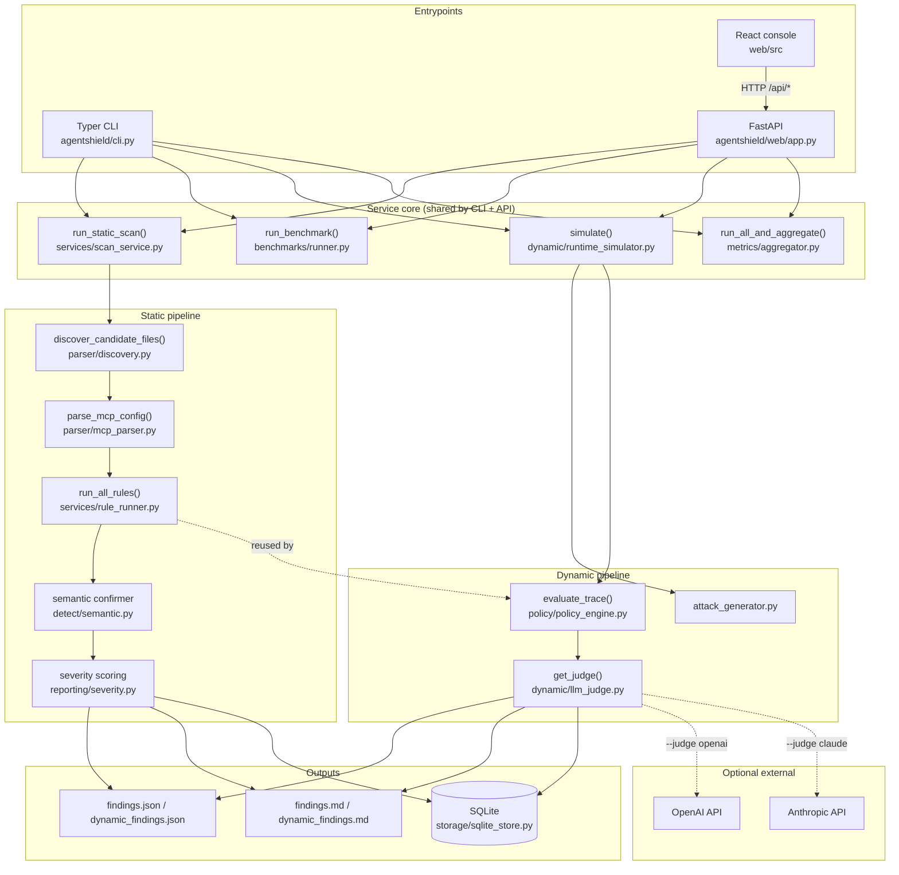
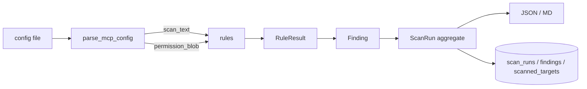
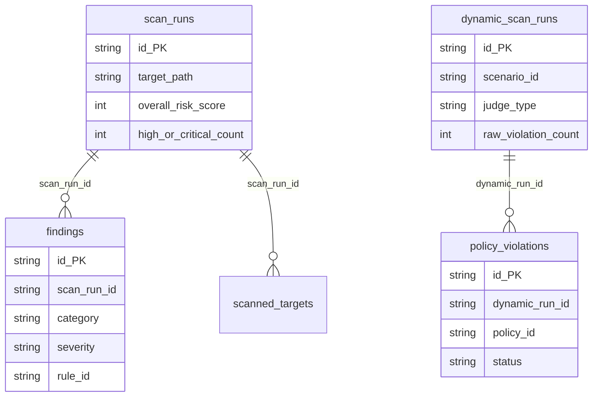
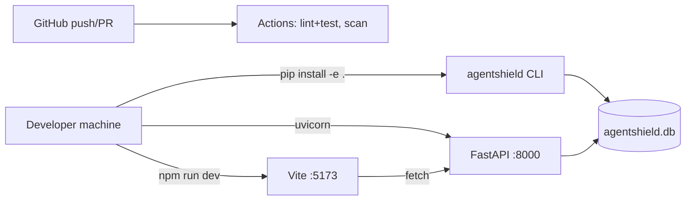

# AgentShield — Architecture

> Detailed architecture, traced from source on 2026-06-24; refreshed 2026-07-09 (semantic
> confirmer, FK schema, live deploy). File paths are clickable references into the repo.
> Companion: [PROJECT_MASTER.md](./internal/PROJECT_MASTER.md).

---

## 1. System overview

AgentShield is a **layered, CLI-first Python application** with three entry surfaces
(CLI, FastAPI, React) that all funnel into the same pure-function service core. There
are two analysis pipelines:

- **Static pipeline** — discover files → parse → run rules → **semantic confirmer**
  (context-aware confirm/dismiss/uncertain over rule candidates,
  `detect/semantic.py`) → score → report + persist.
- **Dynamic pipeline** — generate scripted attack → simulate trace → policy-evaluate →
  (optional) LLM judge → report + persist.

A metrics aggregator runs both pipelines plus the benchmark harness to emit a single
`ProjectMetrics` object. Persistence is local SQLite. No services run continuously;
everything is request/command-scoped and synchronous.

## 2. Architecture diagram

## 3. Request lifecycle

> **API auth.** Every endpoint except `GET /api/health` depends on `require_auth`
> (`app.py`). When `AGENTSHIELD_API_TOKEN` is set, requests must present it via
> `Authorization: Bearer <token>` or `X-API-Key` (timing-safe compare); empty token =
> open, for local dev only. Allowed CORS origins come from `AGENTSHIELD_CORS_ORIGINS`.

### Static scan (`POST /api/scan` or `agentshield scan`)
1. Resolve target path and output dir (`cli.py:69` / `app.py:95`).
2. `run_static_scan()` resolves root; raises `FileNotFoundError` → 404 in API.
3. `discover_candidate_files()` walks the tree (or returns the single file).
4. For each file: `parse_mcp_config()` returns `scan_text` + `permission_blob` +
   normalized MCP surface.
5. `run_all_rules(scan_text, permission_blob=...)` returns `RuleResult`s; the **semantic
   confirmer** (`detect/semantic.py`) dispositions each candidate
   confirm/dismiss/uncertain from surrounding context (recall-safe: only clearly benign
   HIGH/CRITICAL secret mentions are dismissed). Surviving candidates become `Finding`s.
   With `AGENTSHIELD_SEMANTIC_BACKEND=llm` (flag-off by default), HIGH/CRITICAL
   `uncertain` cases can escalate to an LLM under severity + confidence guardrails.
6. `compute_overall_risk_score()` + `count_high_or_critical()` build the `ScanRun`.
7. `persist_scan()` writes to SQLite (CLI always; API when `persist=True`).
8. `build_scan_payload()` + report writers emit JSON/MD.
9. Exit/flag: max severity rank vs `--fail-on` → CLI exit 1 / API `threshold_triggered`.

### Dynamic simulate (`POST /api/simulate` or `agentshield simulate`)
1. Resolve judge via `get_judge()`; CLI takes the key from request/`.env`, the API
   resolves it server-side from `.env` only (never from the request body).
2. Select scenario(s) (`all` or one ID).
3. Per scenario: `simulate(payload)` builds a 5-step `SimTrace`; `evaluate_trace()`
   produces raw `PolicyViolation`s; `judge.evaluate()` splits confirmed/dismissed.
4. Build `DynamicScanResult` (carries raw + confirmed + dismissed + judge metadata).
5. `persist_dynamic_scan()`; write `dynamic_findings.{json,md}`.
6. Exit 1 / `dirty_scenarios>0` if any scenario has confirmed violations.

## 4. Data flow

`permission_blob` is a separate, permission-focused projection of the config (built by
`_walk_permission_strings` / `_permission_subtree` in `parser/mcp_parser.py`) so that
`PERM-*` rules see capability declarations even when buried in nested JSON.

## 5. Service boundaries

| Boundary | Responsibility | Must NOT do |
|---|---|---|
| `cli.py` / `web/app.py` | I/O, arg parsing, exit codes, HTTP | Business logic |
| `services/`, `benchmarks/`, `dynamic/`, `policy/`, `metrics/` | Orchestration + analysis | Touch HTTP/CLI |
| `rules/` | Pure detection functions (`str -> list[RuleResult]`) | Read files / DB |
| `parser/` | File → text/surface | Detection logic |
| `reporting/` | Render + score | Persist |
| `storage/` | SQLite read/write + migrations | Detection / rendering |
| `models/` | Pydantic schemas | Behavior |

The clean rule: **`rules/` are pure functions**, which is why they are reused verbatim
by the dynamic policy engine (`policy_engine.py:115`) — no duplication.

## 6. Frontend / backend responsibility split

- **Frontend (`web/`):** forms, local filtering, presentation, state per-page via React
  hooks. No business logic; no persistence; no auth. Calls `/api/*` only.
- **Backend (`agentshield/web/`):** thin translation of HTTP requests into core service
  calls; Pydantic validation; SQLite read helpers for history/detail views.
- The backend is the **only** writer of truth (SQLite); the frontend never persists.

## 7. Database relationships

> Relationships above are now **enforced by the DB** — `storage/sqlite_store.py` declares
> `FOREIGN KEY` columns with cascades and indexes on FK/ordering columns (landed
> 2026-07-06). `PRAGMA foreign_keys=ON` is set per connection.

## 8. Important modules and what each does

| Module | Role |
|---|---|
| `parser/discovery.py` | Recursively find config, docs, and common source files; skip vendor/build dirs; single file returns itself |
| `parser/mcp_parser.py` | Parse + flatten config; build `scan_text`, `permission_blob`, normalized MCP surface |
| `rules/suspicious_patterns.py` | `SP-001` tool-poisoning imperatives |
| `rules/override_checks.py` | `OV-001/002` hidden-override + indirect injection |
| `rules/permission_checks.py` | `PERM-001/002/003` unsafe permission combos (PERM-003 context-gated) |
| `rules/exfiltration_checks.py` | `EXF-001/002/003` exfil tiers (EXF-003 context-gated) |
| `rules/drift_checks.py` | `DRIFT-001/002` task drift + context spoofing |
| `services/scan_service.py` | Static orchestration → `ScanRun` + `Finding`s + targets; `run_static_scan_on_text` powers self-serve paste-config scans |
| `detect/semantic.py` | Semantic confirmer: deterministic context disposition of rule candidates + optional guarded LLM backend (flag-off) |
| `services/rule_runner.py` | Runs all 5 rule modules; routes `permission_blob` to PERM rules |
| `reporting/severity.py` | Severity rank, high/critical count, weighted 0–100 risk score |
| `reporting/json_report.py`, `markdown_report.py` | Report rendering + PR comment |
| `storage/sqlite_store.py` | Schema init, additive migrations, persist + history reads |
| `benchmarks/loader.py`, `runner.py` | Load YAML cases; scan via tempfile; compare to `expect` |
| `dynamic/attack_generator.py` | 5 deterministic `AttackPayload` scenarios |
| `dynamic/runtime_simulator.py` | Build 5-step scripted `SimTrace` (no LLM) |
| `policy/policy_engine.py` | Static-rule pass (`POLSTA-`) + per-step regex policies (`POLDYN-`) |
| `dynamic/llm_judge.py` | `BaseJudge` + `RuleBased`/`OpenAI`/`Claude` judges + factory |
| `metrics/aggregator.py`, `rule_registry.py`, `report_writer.py` | Build/emit `ProjectMetrics` |
| `web/app.py`, `web/schemas.py` | FastAPI endpoints + request/response models |

## 9. Third-party integrations

| Integration | Where | Required? |
|---|---|---|
| OpenAI Chat Completions | `dynamic/llm_judge.py` `OpenAIJudge` | Optional |
| Anthropic Messages | `dynamic/llm_judge.py` `ClaudeJudge` | Optional |
| GitHub Actions | `.github/workflows/ci.yml`, `scan.yml` | CI only |

Both LLM integrations use stdlib `urllib.request` (no SDK), share a strict-JSON
decision contract, and fail fast with typed errors. Default path uses **no** integration.

## 10. Deployment / runtime architecture

Production deployment now exists: the API runs as a Docker container on **Render**
(`render.yaml`, health check `/api/health`) and the console as a static Vite build on
**Vercel**; local parity via `docker-compose.yml`. See [DEPLOY.md](./DEPLOY.md). The
SQLite file remains the system of record (ephemeral on Render's free plan — paid disk or
Postgres for durable history).

## 11. Failure points and how to improve them

| # | Failure point | Impact | Improvement |
|---|---|---|---|
| 1 | Substring/regex detection | Paraphrase-evadable | Mitigated: deterministic semantic confirmer (F1 98.08% on labeled corpus); LLM tier measured, not a net win yet — needs a stronger model / harder corpus |
| 2 | Self-authored benchmarks + scripted sims | Overstates real accuracy | Partly addressed: 50-artifact labeled corpus; expand the public-only subset |
| 3 | ~~No FK constraints in SQLite~~ | — | **Fixed:** FK cascades + indexes (2026-07-06) |
| 4 | ~~Open API, `CORS *`, no auth~~ | — | **Fixed:** token auth + config-driven CORS |
| 5 | Synchronous web layer | No concurrency story | Async workers / job queue if load grows |
| 6 | `JudgeVerdict.notes` not persisted | Lost rationale | Add column + persist |
| 7 | LLM dismissal by `policy_id` | Over-dismisses repeated IDs | Dismiss per-violation instance |
| 8 | Frontend tests cover only Static Scan + Dashboard pages | Regressions on other pages invisible | Extend RTL suites to remaining pages |
| 9 | Secret files must stay untracked | Secret-leak risk | `.env` is ignored locally; keep only `.env.example` tracked |
| 10 | SQLite on Render's free ephemeral disk | Prod scan history lost on restart | Paid Render disk (documented in `render.yaml`) or Postgres |
