# AgentShield — V2 Architecture Proposal

> A concrete upgrade from the current local-only design to a validated, observable,
> deployable scan service — without throwing away the strong existing seams (pure-function
> rules, `BaseJudge`, thin API). Grounded in the real modules under `agentshield/`.

---

## 1. Three architecture tiers (so we don't over-build)

| Concern | Current (today) | MVP-V2 (next cycle) | Production-grade (later) |
|---|---|---|---|
| Detection | Substring/regex only (`rules/*`) | **Hybrid:** rules pre-filter + semantic confirm (`detect/semantic.py`) | Hybrid + optional fine-tuned model (F12) |
| Validation | 9 self-authored cases | **Labeled corpus + P/R/F1** (`eval/scorer.py`) | Continuous eval in CI + adversarial set |
| Entry | CLI + thin FastAPI + React | Same + **auth** on API | + GitHub App + Lambda endpoint |
| Persistence | SQLite, no FKs | SQLite + FKs/indexes + `detection_stage`/`confidence` | Postgres + Alembic |
| Reports | Local files | Local files | S3/R2 object storage |
| Observability | Rich prints | **Structured logs + OpenTelemetry traces** | + Prometheus/Grafana dashboards |
| Async | None (sync) | None (sync, cached) | Queue + worker for slow semantic scans |
| Deploy | Local processes | **Dockerfile** | Terraform → Lambda/ECS + S3 + collector |

**Rule:** build the **MVP-V2** column next. The production-grade column is Phase 4, added
only along the hosting path.

---

## 2. V2 architecture diagram

```mermaid
flowchart TD
    subgraph Clients
        CLI["CLI: python -m agentshield"]
        GH["GitHub App / Action"]
        UI["React console"]
    end

    CLI --> SVC
    GH -->|webhook| API
    UI -->|/api/* + auth| API["FastAPI (auth + OTel middleware)<br/>web/app.py"]
    API --> SVC

    subgraph SVC["Service core (shared)"]
        SCAN["run_scan(mode)<br/>services/scan_service.py"]
    end

    subgraph Detect["Detection pipeline (NEW: hybrid)"]
        PARSE["parse_mcp_config<br/>parser/mcp_parser.py"]
        RULES["run_all_rules (cheap pre-filter)<br/>services/rule_runner.py"]
        TRIAGE{"ambiguous /<br/>borderline?"}
        SEM["semantic confirm + confidence<br/>detect/semantic.py"]
        CACHE[("verdict cache<br/>content-hash key (Redis/local)")]
        SCORE["severity + risk<br/>reporting/severity.py"]
    end

    SCAN --> PARSE --> RULES --> TRIAGE
    TRIAGE -- "clear signal" --> SCORE
    TRIAGE -- "ambiguous" --> SEM
    SEM <--> CACHE
    SEM --> SCORE

    subgraph Eval["Validation (NEW)"]
        LAB[("benchmarks/labeled/<br/>ground truth")]
        SCORER["eval/scorer.py → P/R/F1"]
    end
    LAB --> SCORER
    RULES -.evaluated by.-> SCORER
    SEM -.evaluated by.-> SCORER

    subgraph Out["Outputs + telemetry"]
        REP["JSON/MD reports<br/>reporting/*"]
        DB[("SQLite/Postgres + FKs<br/>storage/")]
        OTEL["OpenTelemetry spans + structured logs"]
    end
    SCORE --> REP & DB
    SCAN -. spans .-> OTEL
    SEM -. latency/cost/tokens .-> OTEL

    subgraph Ext["External (optional)"]
        LLM["OpenAI / Anthropic<br/>via BaseJudge"]
    end
    SEM -.-> LLM
```



## 3. Request lifecycle (V2 hybrid scan)

1. Client hits `POST /api/scan` (auth dependency validates API key/JWT; OTel middleware
   opens a root span).
2. `run_scan(path, mode="hybrid")` discovers + parses files (`parser/`).
3. **Stage 1 — rules:** `run_all_rules()` runs the cheap deterministic pre-filter.
4. **Triage:** each candidate is routed — *clear* findings (e.g. `EXF-001` critical marker)
   skip the LLM; *ambiguous* ones (low-tier, prose-context, or near-miss) escalate.
5. **Stage 2 — semantic:** `detect/semantic.py` asks an LLM (reusing the `BaseJudge`
   contract) "is this actually a poisoned/injection/exfil instruction?" → returns
   `confidence` + `detection_stage`. Verdict cached by content hash.
6. `severity.py` scores; `Finding` now carries `detection_stage` + `confidence`.
7. Persist (with FKs); write reports (local or S3); spans/logs flushed with token + latency.
8. Response includes `threshold_triggered` (unchanged contract) + per-finding provenance.

## 4. Data flow

```
file → parse → (scan_text, permission_blob)
            → rules → candidate findings
            → triage → {confirmed-by-rule} ∪ {escalate}
escalate → semantic(LLM, cached) → {confirmed, confidence} ∪ {dismissed}
all confirmed → severity/risk → report + DB(+stage,confidence) + OTel
labeled corpus → scorer → precision/recall/F1 → metrics.json (CI artifact)
```

## 5. Service boundaries (unchanged principle, one new module)

- `rules/` stays **pure** (no I/O). New `detect/semantic.py` is the **only** new detection
  module that does I/O (LLM), and it sits behind the same `BaseJudge`-style interface.
- `services/scan_service.py` gains a `mode` param; it remains the single orchestrator
  called by CLI **and** API (thin-API principle preserved — `web/app.py` adds only auth +
  telemetry middleware, no logic).
- New `eval/` and `observability/` packages are cross-cutting and side-effect-isolated.

## 6. Database / storage design

- **MVP-V2:** keep SQLite but add **FK constraints + indexes** (on `scan_run_id`,
  `dynamic_run_id`, `severity`, `category`) and new columns `findings.detection_stage`,
  `findings.confidence`. Keep additive `_ensure_columns()` migration style.
- **Production:** Postgres + Alembic; reports move to S3/R2 with DB holding the object key.
- Persist `JudgeVerdict.notes` (current known gap) in a `notes` column.

## 7. Background job design

- **MVP-V2:** none — hybrid scans stay synchronous but **cached** (verdict cache makes
  repeat scans fast). Sync is fine because triage keeps LLM calls rare.
- **Production:** if semantic scans get slow on large repos, add a queue (SQS/Celery/RQ) +
  worker: `POST /api/scan` returns a `job_id`; `GET /api/scan/{job_id}` polls. Only build
  when a measured latency number justifies it.

## 8. AI / agent workflow design

- **Default:** rules-only, no LLM (preserve `rules_only_rate` honesty + CI speed).
- **Hybrid:** cost-aware escalation — make `metrics/aggregator.py`'s hardcoded
  `llm_routing_rate=0.0` a **real measured ratio** (escalated ÷ total candidates).
- **Advanced (F11):** a LangGraph state graph for exploit-path reasoning — nodes mapped in
  [TECH_STACK_UPGRADE_ANALYSIS.md](./TECH_STACK_UPGRADE_ANALYSIS.md) (LangGraph section).

## 9. Observability design

- **Logs:** stdlib `logging` (or `structlog`) JSON, honoring `config.py`'s existing
  `agentshield_log_level` (currently unused). One log line per scan + per finding.
- **Traces (OpenTelemetry):** spans around `run_scan`, per-file parse, `run_all_rules`,
  `detect.semantic` (attrs: model, tokens, latency, cache hit/miss), `evaluate_trace`.
- **Metrics (production):** `/metrics` Prometheus endpoint — scan count, findings by
  category, p95 latency, LLM cost, error rate; Grafana dashboard.

## 10. Deployment design

- **MVP-V2:** `Dockerfile` (multistage: build frontend → serve API + static). `docker run`
  gives the whole console.
- **Production:** Terraform provisions Lambda (fast path) or ECS (long path) + API Gateway
  + S3 + secrets + OTel collector. GitHub Actions adds a deploy job. EKS/Kafka **excluded**
  by the tech analysis.

## 11. Security design

- `.env` → `.gitignore` (P0). Secrets via env/secret manager, never committed.
- API: replace `CORS allow_origins=["*"]` (`web/app.py:52`) with an explicit allowlist;
  add an auth dependency (API key/JWT) on all `/api/*` except `/api/health`.
- Egress note: hybrid mode sends scanned text to the LLM provider — make it **opt-in** and
  documented; offer a self-hosted-model path (F12) for sensitive users.
- Keep the read-only, no-`eval` scanning posture (already a strength).

## 12. Failure handling

- Preserve fail-fast judge contract (`OpenAIJudgeError`/`ClaudeJudgeError`, exit 2). For
  hybrid scans add **graceful degradation**: if the semantic stage fails/timeouts, fall
  back to rules-only results **with a flag** in the report (`semantic_unavailable=true`) —
  never silently drop findings, never hard-fail a CI scan on an LLM outage.
- Retries/backoff on LLM calls (move off raw `urllib` or wrap it).

## 13. Scaling plan

- Vertical first: triage + verdict cache keep LLM calls rare and cheap → sync scales far.
- Then serverless: Lambda fan-out per file/per repo (stateless fits).
- Then async: queue + workers for large semantic scans.
- Storage: SQLite → Postgres; reports → S3. **No EKS/Kafka** unless a real multi-tenant,
  high-throughput SaaS materializes.

## 14. Current vs MVP vs production — the one-line difference

- **Current:** a correct local scanner whose detector is a wordlist and whose accuracy is
  unmeasured.
- **MVP-V2:** the same scanner with a **measured, intent-aware** detector and a
  **secured, observable, containerized** API.
- **Production-grade:** that, deployed serverless via IaC with durable storage, dashboards,
  and async scaling — added only as hosting demand justifies each piece.
